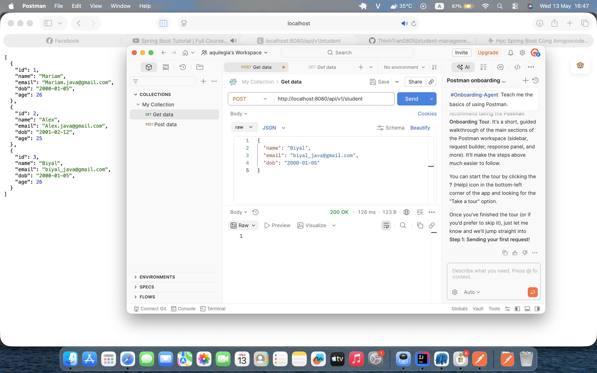

# Spring Boot 2023 Demo Project

## 📝 About This Project

Hey there! This is a simple backend project I built while following the famous **Spring Boot Tutorial (2023)** by **Amigoscode**. 

The main goal of this project is to learn how to build a real-world REST API from scratch using Java and Spring Boot. It's a simple Student Management system where you can do basic stuff like adding, looking up, updating, and deleting student records.

---

### ✨ What's Cool About This Code?

* **Easy to Read:** The code is split into 3 clear layers: `Controller` (handles requests), `Service` (handles logic), and `Repository` (talks to the database).
* **Smart Database Sync:** Spring Boot automatically creates and updates tables in the database for us. No need to write complex SQL by hand to build tables!
* **Clean & Modern:** Built using Java 17, making the code clean, fast, and up-to-date.
---

## 🛠️ Tech Stack & Tools

Here is the simple tech stack I used to build this project:

* **Java 17** - The core programming language.
* **Spring Boot 3.x** - The framework that makes building backend apps super fast.
* **Spring Web** - Used for building REST APIs.
* **Spring Data JPA** - Helps the app talk to the database easily.
* **PostgreSQL** - The database to store all the student data.
* **Maven** - To manage project libraries and dependencies.

---

## 📋 What You Need Before Running (Prerequisites)

Make sure you have these installed on your computer:

1. **JDK 17** or higher.
2. **IntelliJ IDEA** (or VS Code / Eclipse).
3. **PostgreSQL** (running locally or via Docker).
---

## ⚙️ How to Setup the Database

Before running the app, you need to configure your database. 

1. Open **pgAdmin** (or any PostgreSQL tool) and create a new database named `student`.
2. Open the file `src/main/resources/application.yml` in your project and make sure it looks like this:

```yaml
spring:
  datasource:
    url: jdbc:postgresql://localhost:5432/student
    username: postgres
    password: password # <-- Change this to your own PostgreSQL password
  jpa:
    hibernate:
      ddl-auto: create-drop
    show-sql: true
    properties:
      hibernate:
        format_sql: true
        dialect: org.hibernate.dialect.PostgreSQLDialect

server:
  port: 8080
  error:
    include-message: always
```
---

## 🧪 API Endpoints & Testing

Here are the API endpoints available in this project. You can use **Postman** or **cURL** to test them.

| Method | Endpoint | Description |
| :--- | :--- | :--- |
| **GET** | `/api/v1/student` | Get a list of all students |
| **POST** | `/api/v1/student` | Add a new student to the database |
| **DELETE** | `/api/v1/student/{studentId}` | Delete a student by their ID |
| **PUT** | `/api/v1/student/{studentId}` | Update student details (Name or Email) |

### 📸 How it looks in Postman

Here is a screenshot of testing the GET API to fetch student data:

<p align="center">
  
</p>

---
🚀 Happy Coding!
